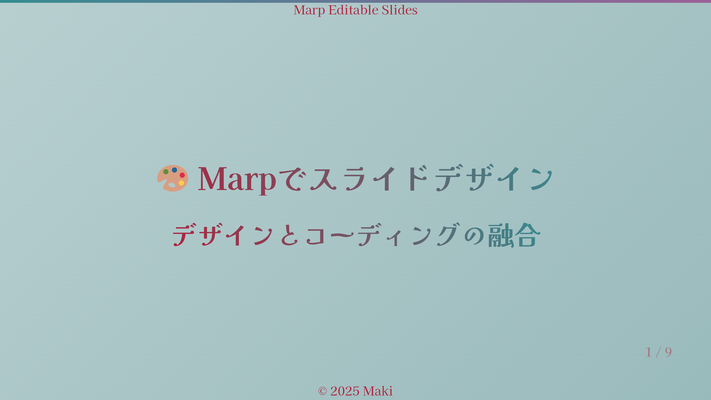

<p align="center">
  
</p>

<div align="center">

[](https://github.com/Sunwood-ai-labs/marp-editable-slides-sample/stargazers)
[](https://github.com/Sunwood-ai-labs/marp-editable-slides-sample/blob/main/LICENSE)
[](https://github.com/Sunwood-ai-labs/marp-editable-slides-sample/commits/main)

[](https://nodejs.org/)
[](https://github.com/marp-team/marp-cli)
[](https://www.libreoffice.org/)

</div>

# 🎯 Marp編集可能スライドサンプル

このリポジトリは、[Marp](https://marp.app/)を使用して編集可能なスライドを作成するためのミニマルなサンプルプロジェクトです。マークダウンで作成したスライドをPDF・PowerPointファイルに変換できます。

## 🔧 技術スタック

- **マークダウンエンジン**: [@marp-team/marpit](https://github.com/marp-team/marpit) v2.6.1
- **CLI ツール**: [@marp-team/marp-cli](https://github.com/marp-team/marp-cli) v4.1.0
- **ファイル監視**: [chokidar](https://github.com/paulmillr/chokidar) v3.5.3
- **PDF/PPTX変換**: [LibreOffice](https://www.libreoffice.org/) v7.5+
- **動作環境**: Node.js v18.0.0以上

## 🚀 特徴

- マークダウンでスライド作成
- PowerPointで編集可能な出力
- PDF出力対応
- プレゼンターノート対応
- ファイル監視による自動生成

## 🎨 サンプルテーマ集

様々なユースケースに対応したテーマサンプルを用意しています：

### 🐱 Sample 01: 猫猫カンパニー

企業プレゼンテーションを可愛らしい猫テーマで表現したサンプル。
[詳細を見る](example/sample01/README.md)

### 🎨 Sample 02: ダークレッド＆ティール

ダークレッドとティールカラーを基調とした現代的なテーマ。
[詳細を見る](example/sample02/README.md)

### 💼 Sample 03: ビジネスクリーン

クリーンでプロフェッショナルなビジネス向けテーマ。
[詳細を見る](example/sample03/README.md)

### 💻 Sample 04: テックダーク

技術プレゼンテーションに特化したダークテーマ。
[詳細を見る](example/sample04/README.md)

### 🎨 Sample 05: ビビッドクリエイティブ

クリエイティブな表現のための鮮やかなテーマ。
[詳細を見る](example/sample05/README.md)

[サンプル一覧をもっと見る](example/README.md)

## 📦 インストール

### 1. 依存関係のインストール

```bash
npm install
```

### 2. LibreOfficeのインストール（PowerPoint出力用）

PowerPointで編集可能なファイル（.pptx）を生成するには、LibreOfficeのインストールが必要です：

1. [Vector（窓の杜）からLibreOfficeをダウンロード](https://forest.watch.impress.co.jp/library/software/libreoffice/)
2. ダウンロードしたインストーラーを実行
3. デフォルト設定でインストールを完了

※ LibreOfficeは、PowerPoint形式（.pptx）での出力に必要です。インストールせずにPDF形式での出力は可能です。

## 🛠️ 使用方法

### スライドの作成・編集

1. `slides.md`を任意のテキストエディタで作成・編集
2. マークダウン形式でスライドを記述
3. ビルドコマンドで目的の形式に変換

### コマンド一覧

```bash
# HTML形式で出力
npm run build

# PDF形式で出力
npm run build:pdf

# PowerPoint形式で出力（編集可能）
npm run build:pptx

# HTML形式でファイル監視（変更時自動生成）
npm run watch

# PDF形式でファイル監視
npm run watch:pdf

# PowerPoint形式でファイル監視
npm run watch:pptx
```

### 出力ファイル

各コマンドを実行すると、以下のようなファイルが生成されます：

- `slides.html`：HTML形式のスライド
- `slides.pdf`：PDF形式のスライド
- `slides.pptx`：PowerPoint形式のスライド（編集可能）

## 📝 編集のヒント

### マークダウン記法

```markdown
---
marp: true
theme: default
---

# スライドのタイトル
内容を記述

---

## 次のスライド
- 箇条書き1
- 箇条書き2
```

### プレゼンターノートの追加

```markdown
# スライドのタイトル

内容

<!-- 
これはプレゼンターノートです
発表時の補足情報として使用できます
-->
```

## 🔧 カスタマイズ

### テーマの変更

`slides.md`のフロントマターでテーマを指定できます：

```markdown
---
marp: true
theme: gaia  # default, gaia, uncover
---
```

### カスタムCSSの適用

1. CSSファイルを作成（例：`custom-theme.css`）
2. ビルドコマンドに`--theme`オプションを追加：

```bash
npx @marp-team/marp-cli slides.md --theme custom-theme.css
```

## 📄 ライセンス

MIT License

## 🤝 貢献

1. このリポジトリをフォーク
2. 機能ブランチを作成
3. 変更をコミット
4. ブランチにプッシュ
5. プルリクエストを作成

## ⭐ スター付けのお願い

このプロジェクトが気に入りましたら、GitHubスターをつけていただけると嬉しいです！
