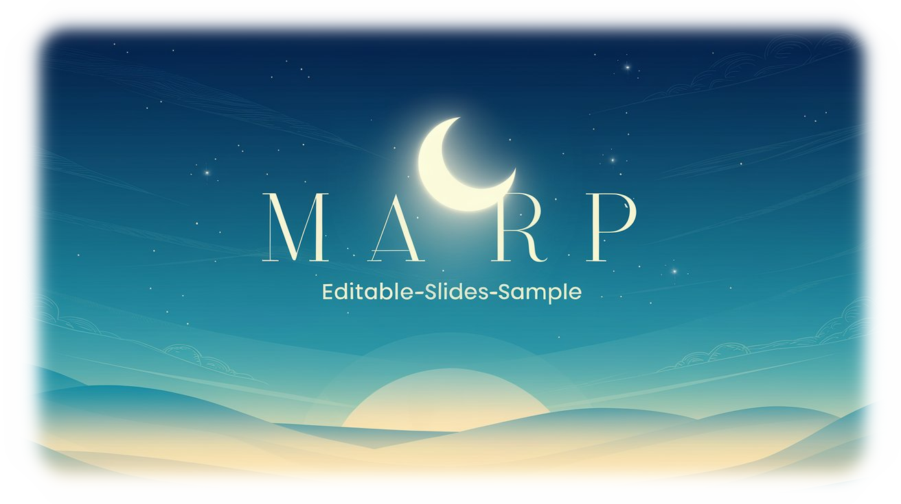

<div align="center">
  

# 🎯 Marp Editable Slides Sample


[](https://github.com/Sunwood-ai-labs/marp-editable-slides-sample/stargazers)
[](https://opensource.org/licenses/MIT)
[](https://github.com/Sunwood-ai-labs/marp-editable-slides-sample/commits/main)

</div>

このリポジトリは、[Marp](https://marp.app/)を使用して編集可能なスライドを作成するためのミニマルなサンプルプロジェクトです。

## 💻 技術スタック

- **フレームワーク**
  - [Marp CLI](https://github.com/marp-team/marp-cli) v4.1.0
  - [Express](https://expressjs.com/) v4.18.2
  - [Socket.IO](https://socket.io/) v4.7.2

- **開発ツール**
  - [Concurrently](https://github.com/open-cli-tools/concurrently)
  - [Nodemon](https://nodemon.io/)

## 🚀 特徴

- マークダウンでスライド作成
- PowerPointで編集可能な出力
- リアルタイムプレビュー
- PDF出力対応
- プレゼンターノート対応

## 📦 インストール

### 1. 依存関係のインストール

```bash
# 依存関係のインストール
npm install
```

### 2. LibreOfficeのインストール

PowerPointで編集可能なファイル（.pptx）を生成するには、LibreOfficeのインストールが必要です：

1. [Vector（窓の杜）からLibreOfficeをダウンロード](https://forest.watch.impress.co.jp/library/software/libreoffice/)
2. ダウンロードしたインストーラーを実行
3. デフォルト設定でインストールを完了

※ LibreOfficeは、PowerPoint形式（.pptx）での出力に必要です。インストールせずにPDF形式やHTML形式での出力は可能です。

## 🛠️ 使用方法

### スライド編集

1. `slides.md`を任意のテキストエディタで開きます
2. マークダウン形式でスライドを編集します
3. 保存すると自動でプレビューが更新されます

### コマンド一覧

```bash
# リアルタイムプレビュー
npm run start

# PDF・PowerPointファイルの生成
npm run build

# PDFのみ生成
npm run build:pdf

# 編集可能なPowerPointのみ生成
npm run build:pptx

# ライブプレビュー（変更の監視）
npm run watch
```

### 出力ファイルについて

各コマンドを実行すると、以下のような出力が表示されます：

```bash
[  INFO ] Converting 1 markdown...
[  INFO ] example\sample01\slides.md => example\sample01\slides.pptx
```
npx marp slides.md  --pptx --pptx-editabl --theme dark-red-teal.css
生成されるファイル：
- `slides.html`：プレビュー用のHTML
- `slides.pdf`：PDF形式のスライド
- `slides.pptx`：PowerPointで編集可能なプレゼンテーション

出力先：
- すべてのファイルは`example/sample01/`ディレクトリに生成されます
- 既存のファイルは上書きされます
- ファイル名は元のMarkdownファイル（`slides.md`）の名前に基づいて生成されます

#### 出力ファイルの特徴

1. **HTML（`slides.html`）**
   - ブラウザでプレビュー可能
   - CSSアニメーションが利用可能
   - プレゼンターノートの表示対応

2. **PDF（`slides.pdf`）**
   - 印刷用に最適化
   - 高品質な文字表示
   - 各スライドが個別ページに

3. **PowerPoint（`slides.pptx`）**
   - Microsoft PowerPointで編集可能
   - スライドの微調整が可能
   - プレゼンテーション効果の追加可能

## 📝 編集のヒント

### マークダウン記法

```markdown
---
marp: true
theme: default
---

# スライドのタイトル
内容を記述

---

## 次のスライド
- 箇条書き1
- 箇条書き2
```

### プレゼンターノートの追加

```markdown
# スライドのタイトル

内容

<!-- 
これはプレゼンターノートです
発表時の補足情報として使用できます
-->
```

## 🔧 カスタマイズ

### テーマの変更

`slides.md`のフロントマターでテーマを指定できます：

```markdown
---
marp: true
theme: gaia  # default, gaia, uncover
---
```

## 📄 ライセンス

MIT License

## 🤝 貢献

1. このリポジトリをフォーク
2. 機能ブランチを作成
3. 変更をコミット
4. ブランチにプッシュ
5. プルリクエストを作成

## ⭐ スター付けのお願い

このプロジェクトが気に入りましたら、GitHubスターをつけていただけると嬉しいです！
