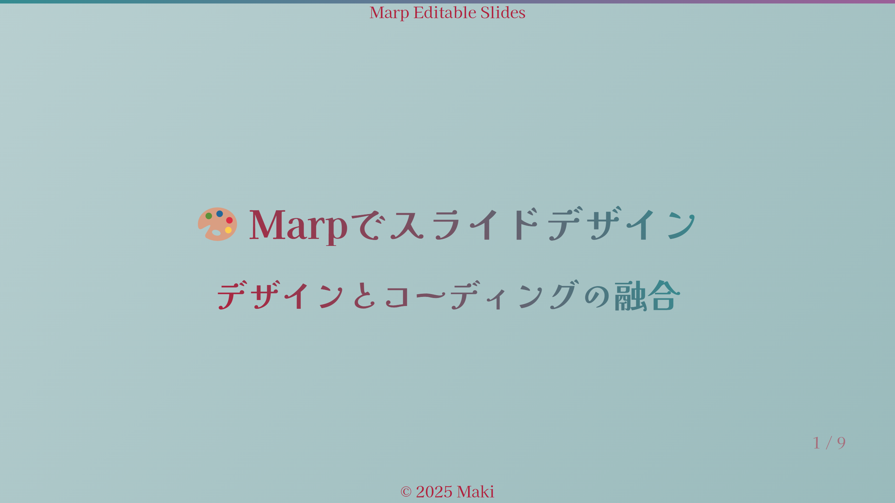
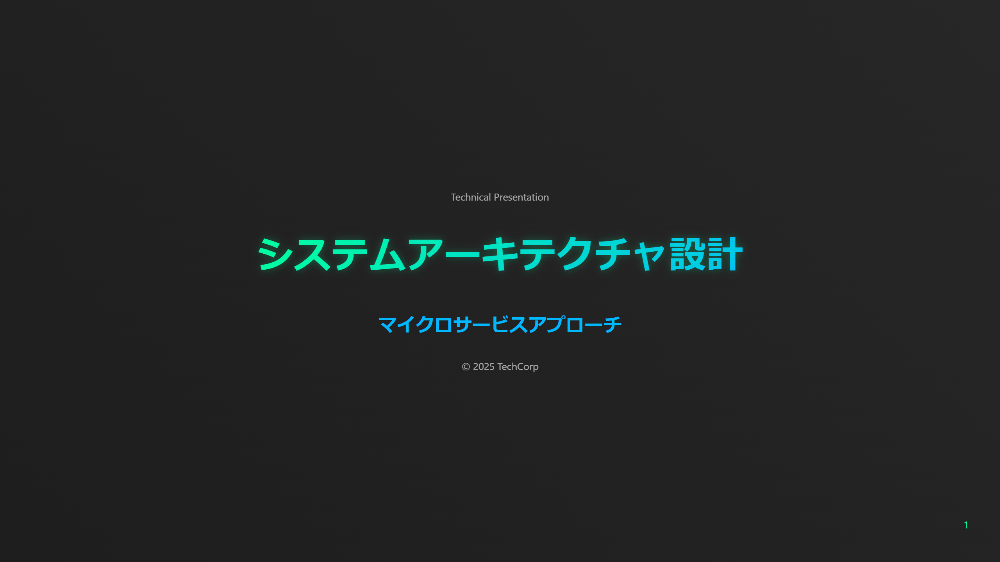
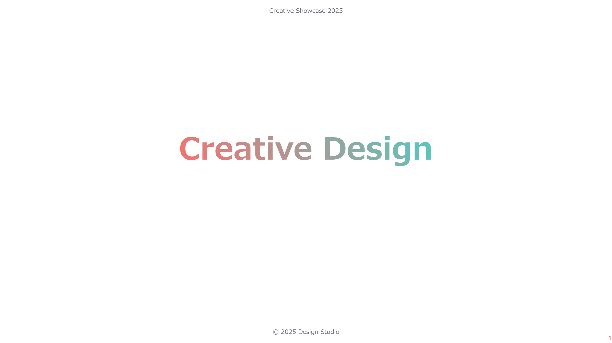

# 🎨 Marpスライドテーマサンプル集

このディレクトリには、Marpで使用できる様々なテーマのサンプルが含まれています。

## 📚 サンプル一覧

### 🐱 Sample 01: 猫猫カンパニー

企業プレゼンテーションを可愛らしい猫テーマで表現したサンプル。
優しい色使いと親しみやすいデザインが特徴です。

[詳細を見る](./sample01/README.md)

### 🎨 Sample 02: ダークレッド＆ティール

ダークレッドとティールカラーを基調とした現代的なテーマ。
和風フォントとグラデーションを効果的に使用しています。

[詳細を見る](./sample02/README.md)

### 💼 Sample 03: ビジネスクリーン

クリーンでプロフェッショナルなビジネス向けテーマ。
データ表示やダイアグラムの表現に優れています。

[詳細を見る](./sample03/README.md)

### 💻 Sample 04: テックダーク

技術プレゼンテーションに特化したダークテーマ。
コードブロックとシンタックスハイライトが特徴です。

[詳細を見る](./sample04/README.md)

### 🎨 Sample 05: ビビッドクリエイティブ

クリエイティブな表現のための鮮やかなテーマ。
アニメーションとインタラクティブ要素を活用しています。

[詳細を見る](./sample05/README.md)

## 🛠️ 使用方法

各サンプルディレクトリには以下のファイルが含まれています：

- `slides.md` - サンプルスライドのソース
- `*.css` - テーマ定義ファイル
- `images/` - 生成されたスライド画像
- `README.md` - 詳細な説明とプレビュー

## 🔧 カスタマイズ

1. 必要なテーマのCSSファイルをコピー
2. スライドのフロントマターでテーマを指定：
```markdown
---
marp: true
theme: your-theme-name
---
```
3. Marp CLIでビルド：
```bash
npx @marp-team/marp-cli slides.md --theme ./your-theme.css
```

## 📝 ライセンス

各テーマは MIT ライセンスの下で提供されています。
商用・非商用問わず自由にご利用いただけます。
