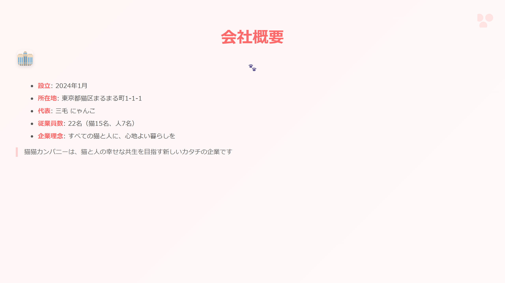
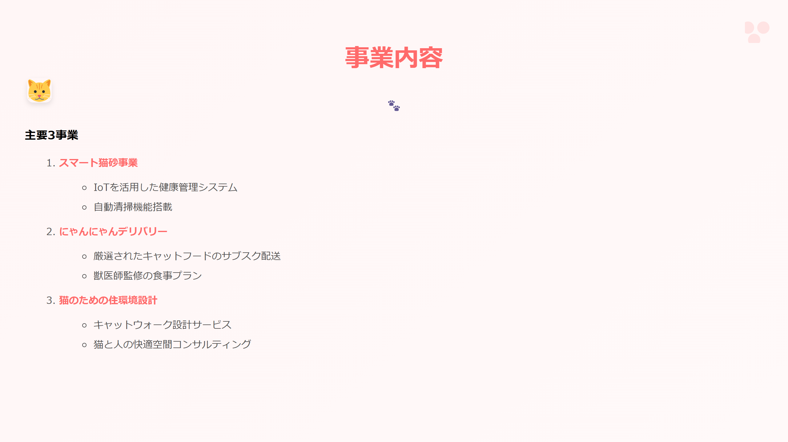
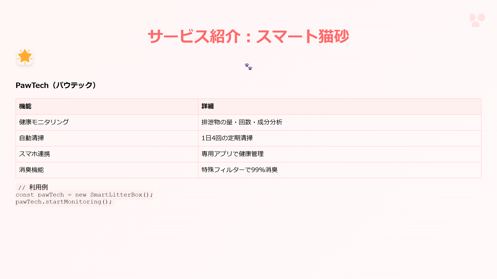
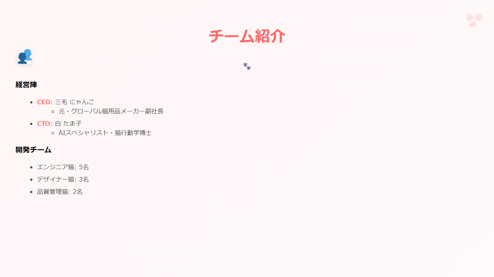
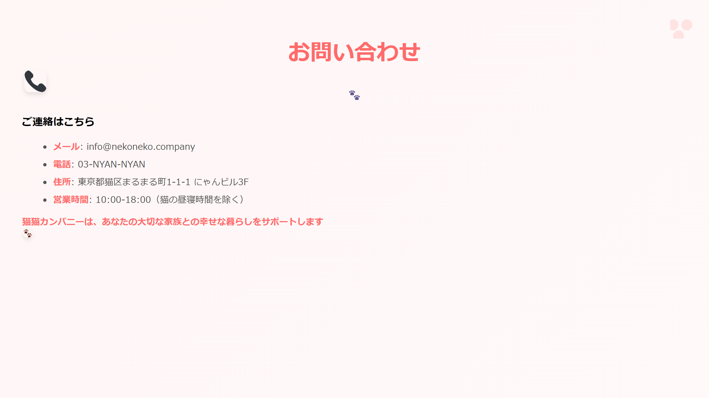

# 🎯 猫猫カンパニープレゼンテーション

このサンプルは、企業プレゼンテーションのテーマを使用した可愛らしい猫企業のスライドデッキです。

## 📷 追加のスライドプレビュー








## 🎨 特徴

- 猫をモチーフにした企業プレゼンテーションデザイン
- 優しい色使いと親しみやすいレイアウト
- カスタムCSSテーマの活用

## 💫 スタイルの特徴

```css
/* スタイルのハイライト */
section {
  background: linear-gradient(135deg, #fff6f6 0%, #fff9f9 100%);
  font-family: "Hiragino Kaku Gothic Pro", "ヒラギノ角ゴ Pro W3", Meiryo, メイリオ;
}

h1 {
  color: #ff6b6b;
}
```

## 🛠️ 使用方法

1. `slides.md`にコンテンツを記述
2. `style.css`をテーマとして指定
3. Marp CLIでビルド：
```bash
npx @marp-team/marp-cli slides.md --theme ./style.css
```

## 📦 ファイル構成

- `slides.md` - プレゼンテーションのソース
- `style.css` - カスタムテーマ定義
- `images/` - 使用する画像ファイル

[サンプル一覧に戻る](../README.md)
