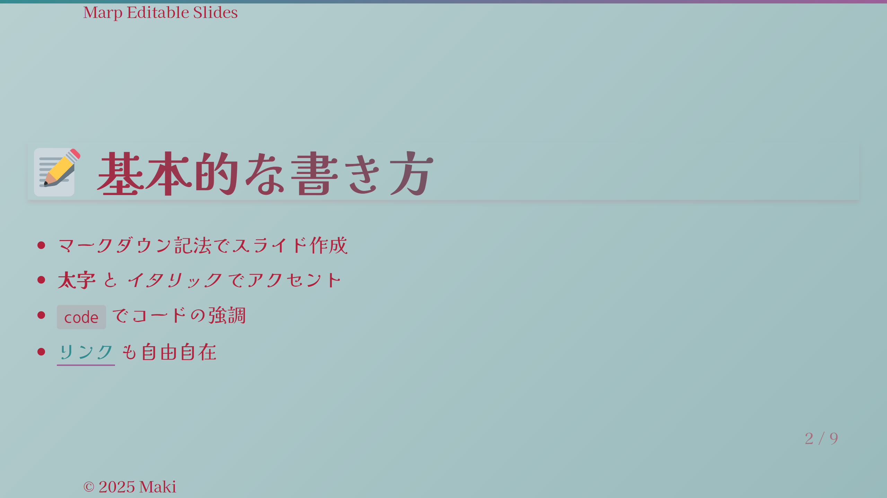
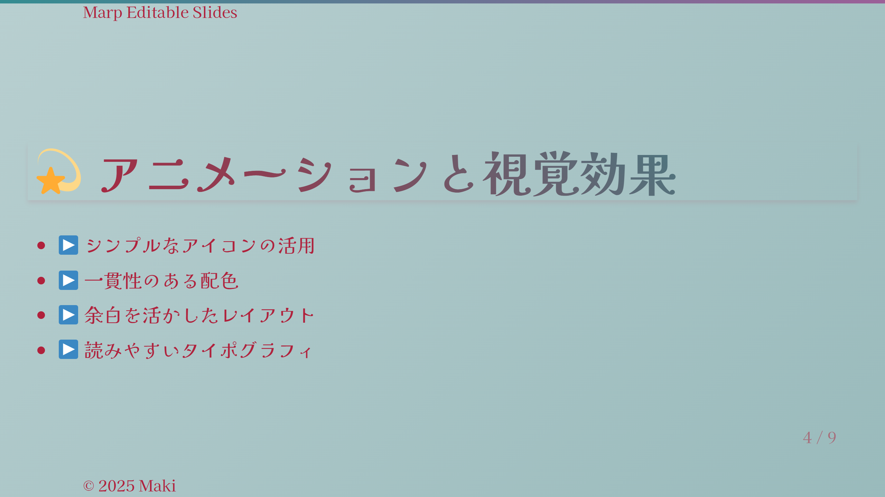
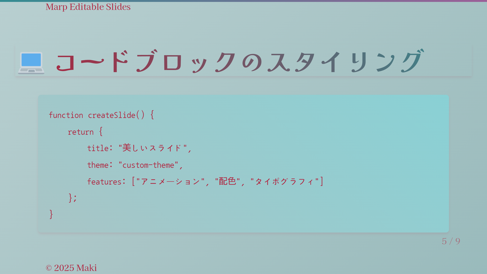
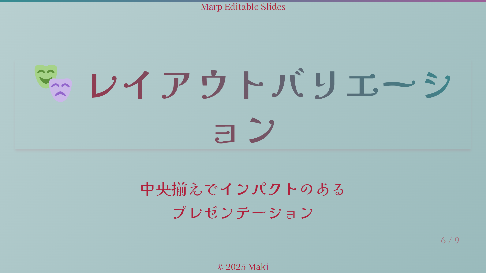
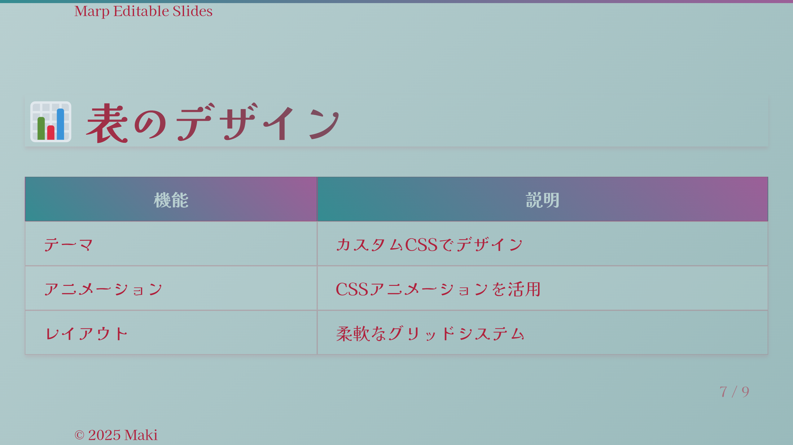
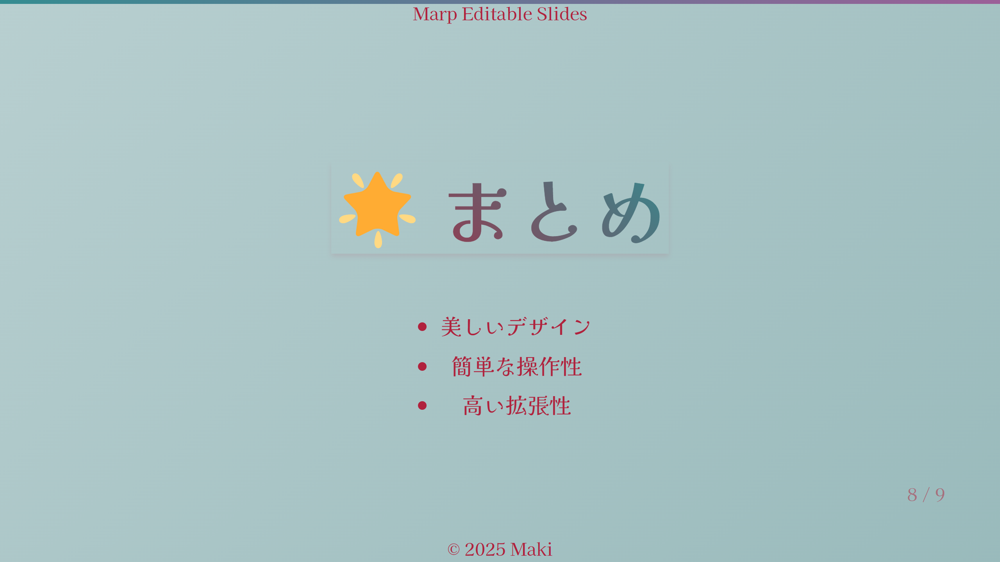
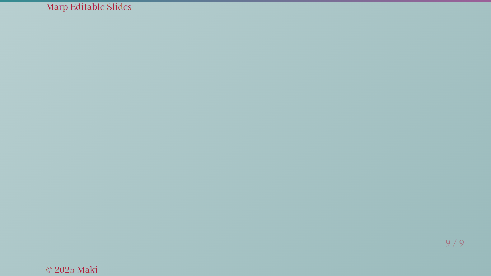

# 🎨 ダークレッド＆ティールテーマ

このサンプルは、ダークレッドとティールカラーを基調とした現代的なプレゼンテーションテーマです。

## 📷 追加のスライドプレビュー











## 🎨 デザインの特徴

- ダークレッドとティールのグラデーションを活用
- モダンなタイポグラフィー
- コントラストの効いた配色
- 和風フォントの活用

## 💫 スタイルのハイライト

```css
/* グラデーションの例 */
section {
  background: linear-gradient(135deg, #b8cfd0, rgb(153, 186, 187));
  color: #b0213c;
}

h1, h2, h3, h4, h5, h6 {
  background: linear-gradient(45deg, #b0213c, #348c91);
  -webkit-background-clip: text;
  -webkit-text-fill-color: transparent;
}
```

## 🛠️ 使用方法

1. `slides.md`にコンテンツを記述
2. `dark-red-teal.css`をテーマとして指定
3. Marp CLIでビルド：
```bash
npx @marp-team/marp-cli slides.md --theme ./dark-red-teal.css
```

## 📦 ファイル構成

- `slides.md` - プレゼンテーションのソース
- `dark-red-teal.css` - カスタムテーマ定義
- `images/` - 生成された画像ファイル

[サンプル一覧に戻る](../README.md)
