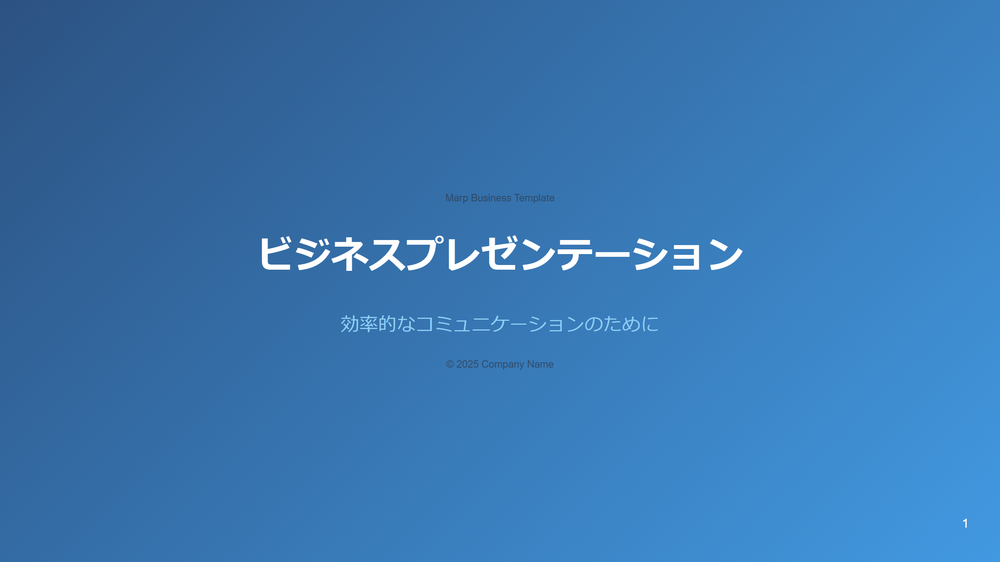
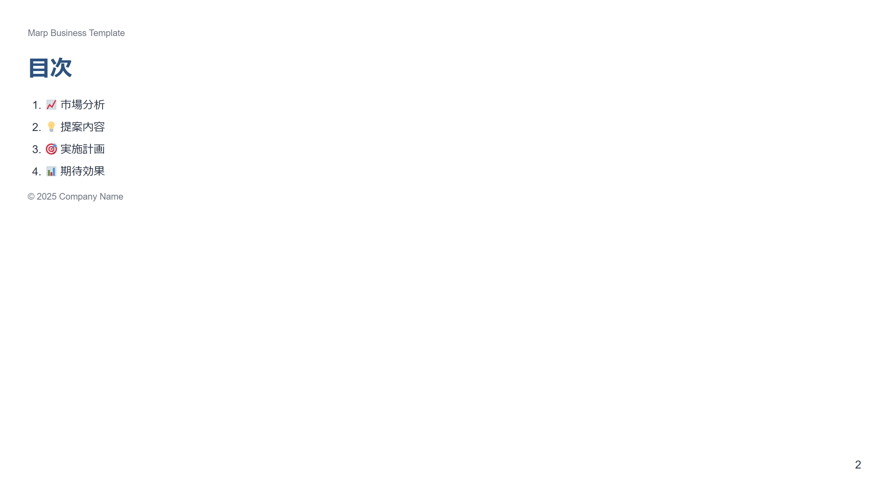
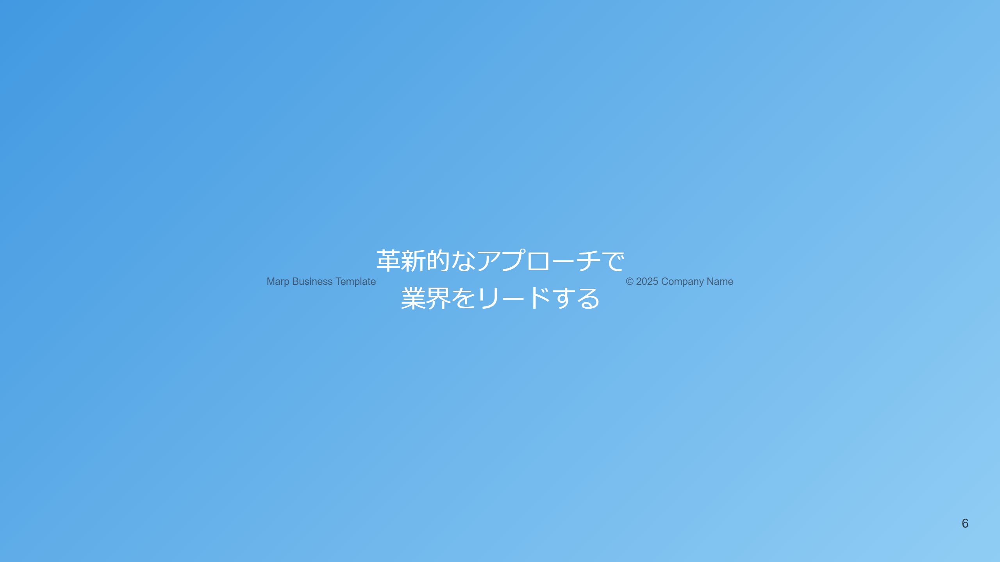
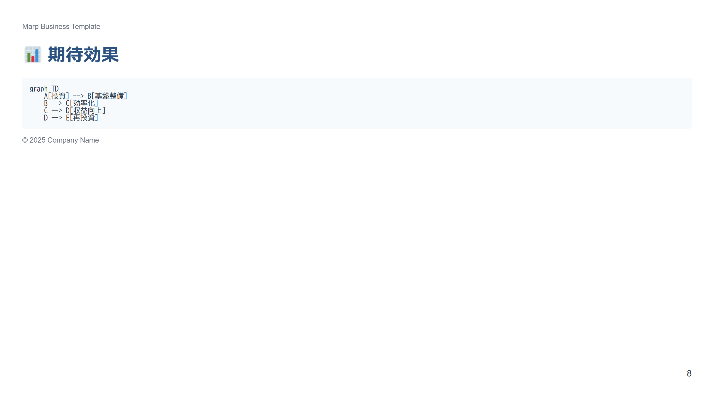
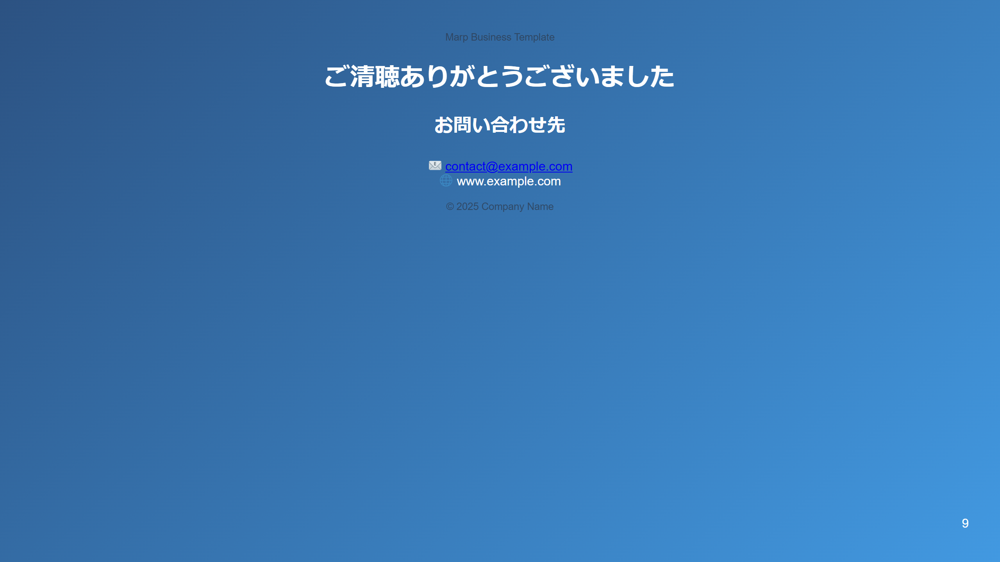

# 💼 ビジネスクリーンテーマ

このサンプルは、クリーンでプロフェッショナルなビジネス向けプレゼンテーションテーマです。

## 📷 スライドプレビュー










## 🎨 デザインの特徴

- クリーンでプロフェッショナルなレイアウト
- ビジネスに適した配色
- 読みやすいタイポグラフィー
- Mermaidダイアグラムのサポート

## 💫 スタイルのハイライト

```css
/* カラー設定 */
:root {
    --primary-color: #2C5282;
    --secondary-color: #4299E1;
    --accent-color: #90CDF4;
    --text-color: #2D3748;
    --background-color: #FFFFFF;
}

/* データ表示用スタイル */
section.data table {
    width: 100%;
    border-collapse: collapse;
    margin: 20px 0;
}

section.data th {
    background: var(--primary-color);
    color: white;
}
```

## 🛠️ 使用方法

1. `slides.md`にコンテンツを記述
2. `business-clean.css`をテーマとして指定
3. Marp CLIでビルド：
```bash
npx @marp-team/marp-cli slides.md --theme ./business-clean.css
```

## 📦 ファイル構成

- `slides.md` - プレゼンテーションのソース
- `business-clean.css` - カスタムテーマ定義
- `images/` - 生成された画像ファイル

## 📊 特別機能

- Mermaidダイアグラムのサポート
- データ表示用の特殊テーブルスタイル
- 引用ブロックのデザイン
