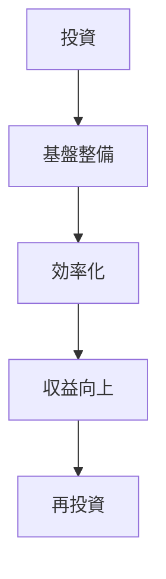

<!-- _class: title -->
# ビジネスプレゼンテーション
## 効率的なコミュニケーションのために

---

# 目次

1. 📈 市場分析
2. 💡 提案内容
3. 🎯 実施計画
4. 📊 期待効果

---

<!-- _class: content -->
# 📈 市場分析

## 現状の課題

- 市場規模の拡大
- 競合他社の動向
- 顧客ニーズの変化

---

<!-- _class: data -->
# 💹 四半期の業績推移

| 期間 | 売上高 | 成長率 |
|------|--------|--------|
| Q1   | 100M   | -      |
| Q2   | 120M   | +20%   |
| Q3   | 150M   | +25%   |
| Q4   | 200M   | +33%   |

---

<!-- _class: content -->
# 💡 提案内容

## 新規事業展開

1. オンラインサービスの拡充
2. 顧客サポートの強化
3. データ分析基盤の整備

---

<!-- _class: quote -->
> 革新的なアプローチで
> 業界をリードする

---

<!-- _class: content -->
# 🎯 実施計画

## タイムライン

- Phase 1: 準備期間（2ヶ月）
- Phase 2: 試験運用（3ヶ月）
- Phase 3: 本格展開（6ヶ月）

---

# 📊 期待効果

---

<!-- _class: closing -->
# ご清聴ありがとうございました

## お問い合わせ先

📧 contact@example.com
🌐 www.example.com
