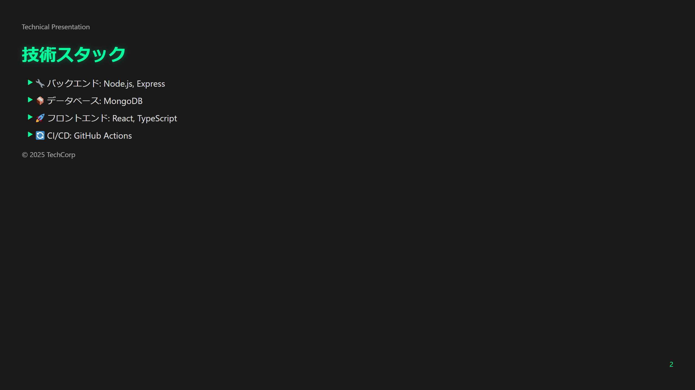
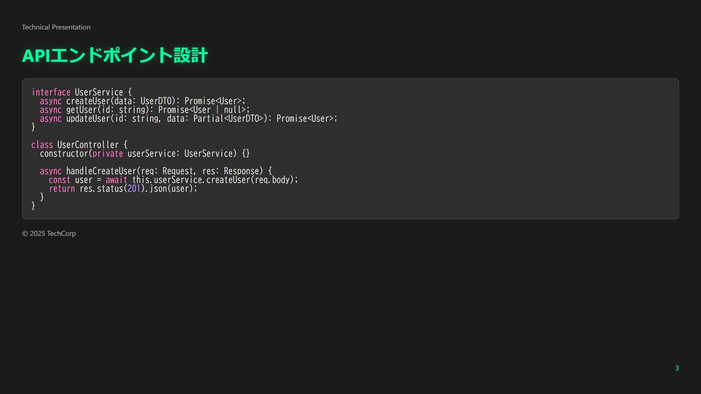
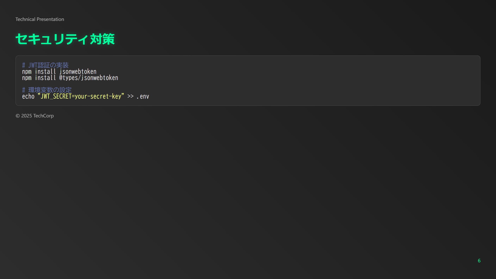
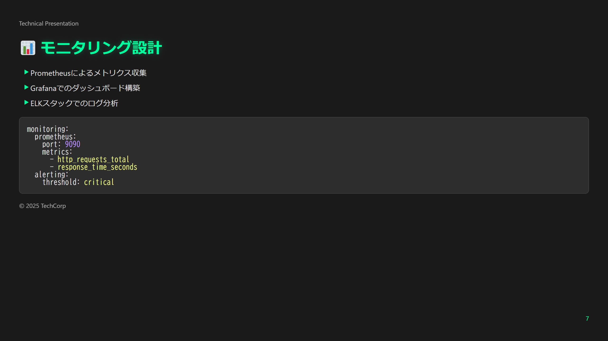
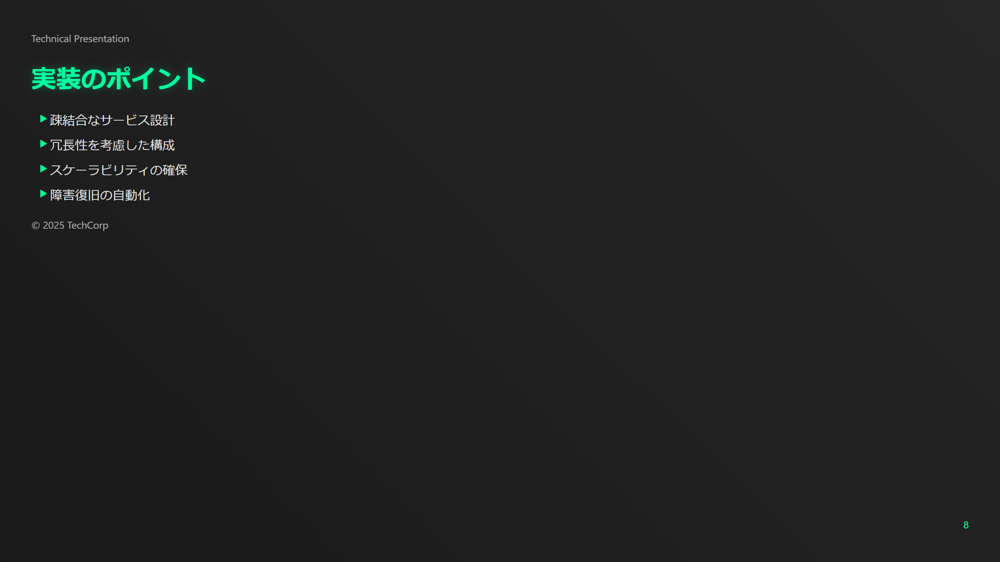
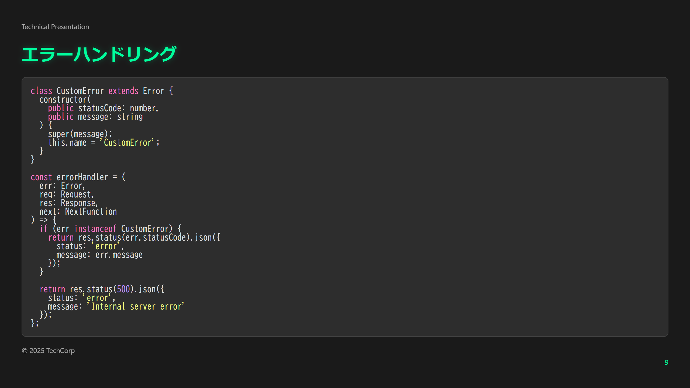
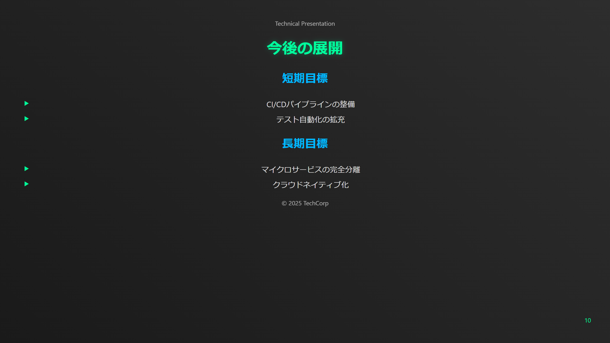

# 💻 テックダークテーマ

このサンプルは、技術プレゼンテーションに特化したダークテーマです。

## 📷 スライドプレビュー












## 🎨 デザインの特徴

- ダークモードベースの視認性の高いデザイン
- プログラミングコードのシンタックスハイライト
- テクニカルダイアグラムの最適表示
- ネオンアクセントカラーの効果的な使用

## 💫 スタイルのハイライト

```css
/* 基本設定 */
:root {
    --primary-color: #00ff9d;
    --secondary-color: #00b8ff;
    --background-dark: #1a1a1a;
    --code-background: #2d2d2d;
    --text-color: #e0e0e0;
}

/* コードブロックスタイル */
pre {
    background: var(--code-background);
    border-radius: 8px;
    padding: 1em;
    font-family: var(--font-family-code);
    border: 1px solid var(--border-color);
}

/* シンタックスハイライト */
.hljs-keyword { color: #ff79c6; }
.hljs-string { color: #f1fa8c; }
.hljs-comment { color: #6272a4; }
```

## 🛠️ 使用方法

1. `slides.md`にコンテンツを記述
2. `tech-dark.css`をテーマとして指定
3. Marp CLIでビルド：
```bash
npx @marp-team/marp-cli slides.md --theme ./tech-dark.css
```

## 📦 ファイル構成

- `slides.md` - プレゼンテーションのソース
- `tech-dark.css` - カスタムテーマ定義
- `images/` - 生成された画像ファイル

## 🔧 技術的特徴

- TypeScriptコードのハイライト
- システム構成図のサポート
- パフォーマンスメトリクスの表示
- セキュリティ設定のコードブロック
