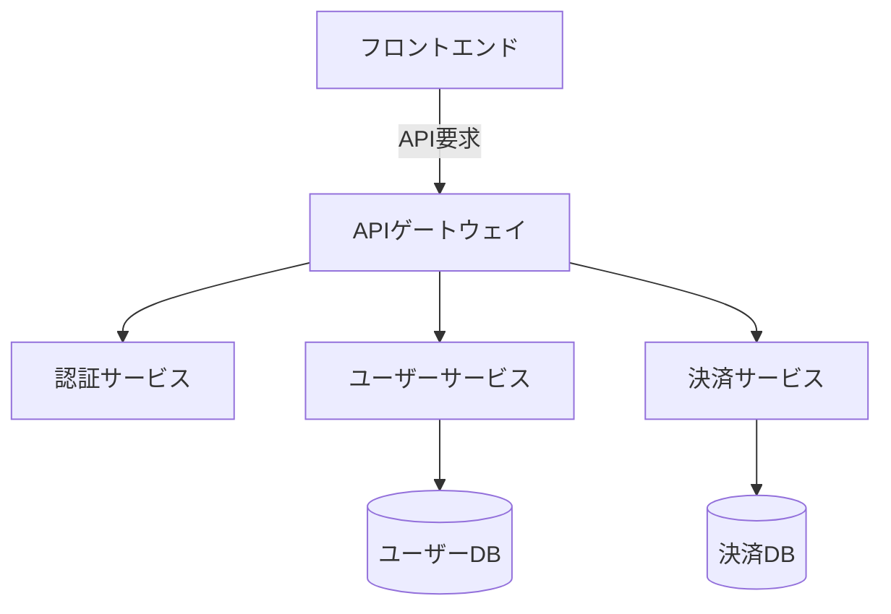

<!-- _class: title -->
# システムアーキテクチャ設計
## マイクロサービスアプローチ

---

# 技術スタック

- 🔧 バックエンド: Node.js, Express
- 📦 データベース: MongoDB
- 🚀 フロントエンド: React, TypeScript
- 🔄 CI/CD: GitHub Actions

---

<!-- _class: code-example -->
# APIエンドポイント設計

```typescript
interface UserService {
  async createUser(data: UserDTO): Promise<User>;
  async getUser(id: string): Promise<User | null>;
  async updateUser(id: string, data: Partial<UserDTO>): Promise<User>;
}

class UserController {
  constructor(private userService: UserService) {}

  async handleCreateUser(req: Request, res: Response) {
    const user = await this.userService.createUser(req.body);
    return res.status(201).json(user);
  }
}
```

---

# システム構成図



---

<!-- _class: performance -->
# パフォーマンス指標

| メトリクス | 目標値 | 現状 |
|------------|--------|------|
| レイテンシ | <100ms | 95ms |
| スループット | 1000rps | 850rps |
| エラー率 | <0.1% | 0.05% |

---

<!-- _class: security -->
# セキュリティ対策

```bash
# JWT認証の実装
npm install jsonwebtoken
npm install @types/jsonwebtoken

# 環境変数の設定
echo "JWT_SECRET=your-secret-key" >> .env
```

---

# 📊 モニタリング設計

- Prometheusによるメトリクス収集
- Grafanaでのダッシュボード構築
- ELKスタックでのログ分析

```yaml
monitoring:
  prometheus:
    port: 9090
    metrics:
      - http_requests_total
      - response_time_seconds
  alerting:
    threshold: critical
```

---

<!-- _class: implementation -->
# 実装のポイント

1. 疎結合なサービス設計
2. 冗長性を考慮した構成
3. スケーラビリティの確保
4. 障害復旧の自動化

---

# エラーハンドリング

```typescript
class CustomError extends Error {
  constructor(
    public statusCode: number,
    public message: string
  ) {
    super(message);
    this.name = 'CustomError';
  }
}

const errorHandler = (
  err: Error,
  req: Request,
  res: Response,
  next: NextFunction
) => {
  if (err instanceof CustomError) {
    return res.status(err.statusCode).json({
      status: 'error',
      message: err.message
    });
  }
  
  return res.status(500).json({
    status: 'error',
    message: 'Internal server error'
  });
};
```

---

<!-- _class: closing -->
# 今後の展開

## 短期目標
- CI/CDパイプラインの整備
- テスト自動化の拡充

## 長期目標
- マイクロサービスの完全分離
- クラウドネイティブ化
