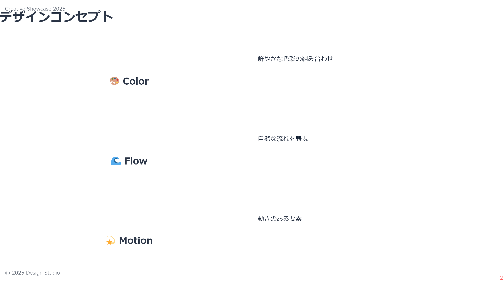
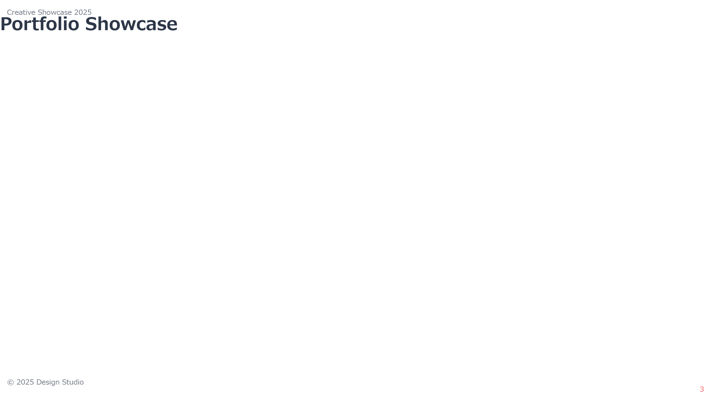
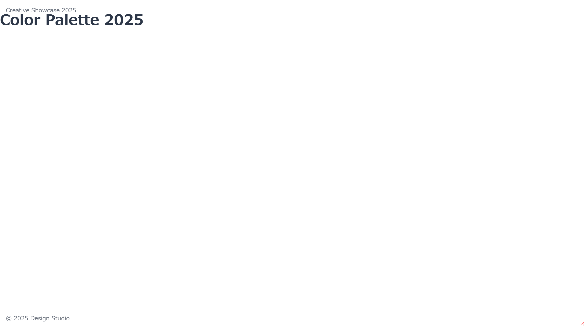
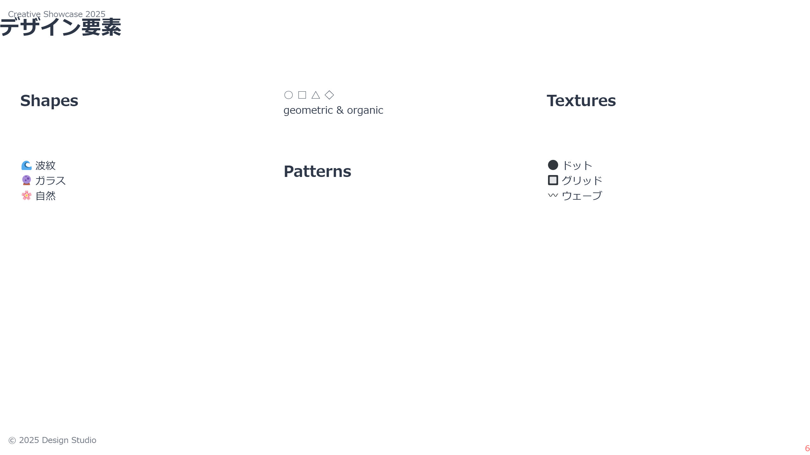
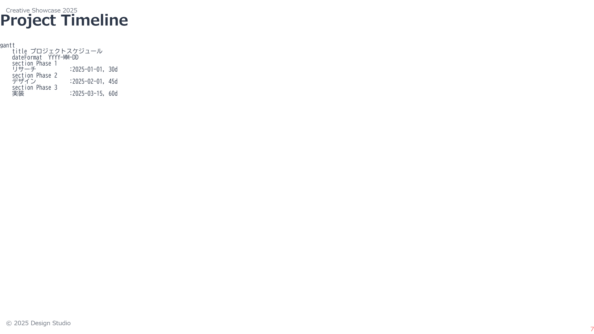
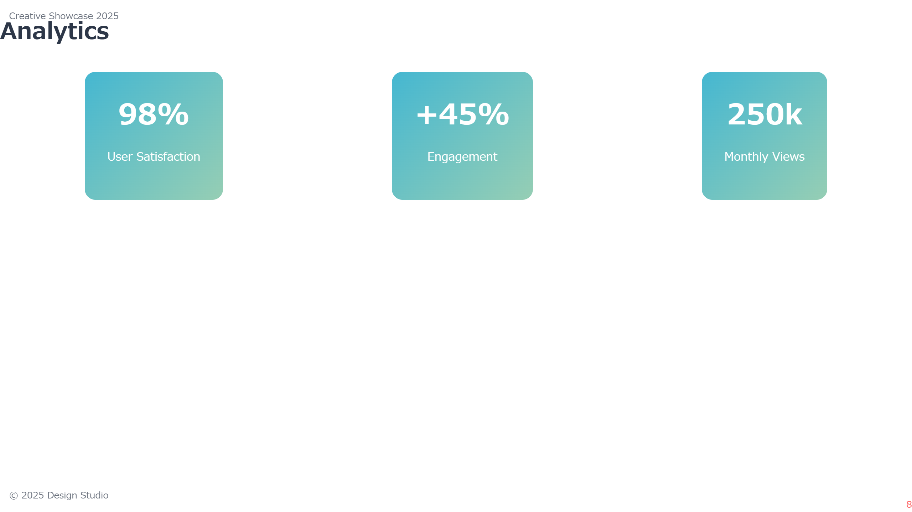
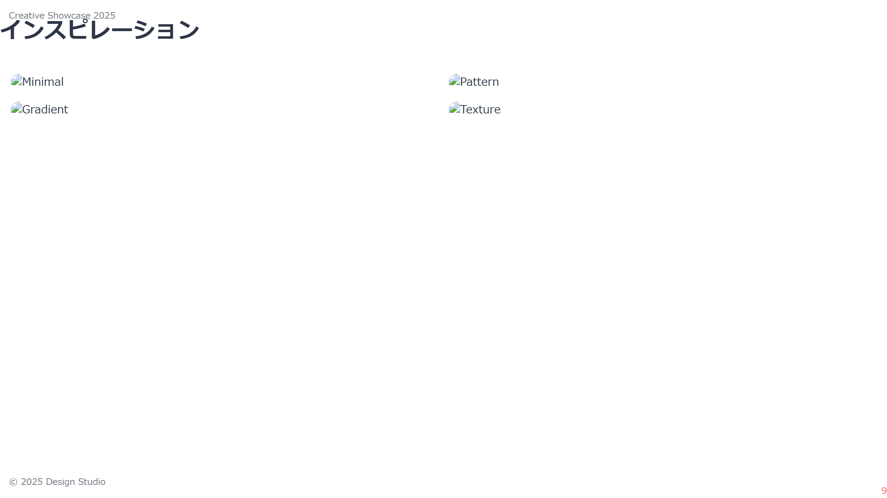
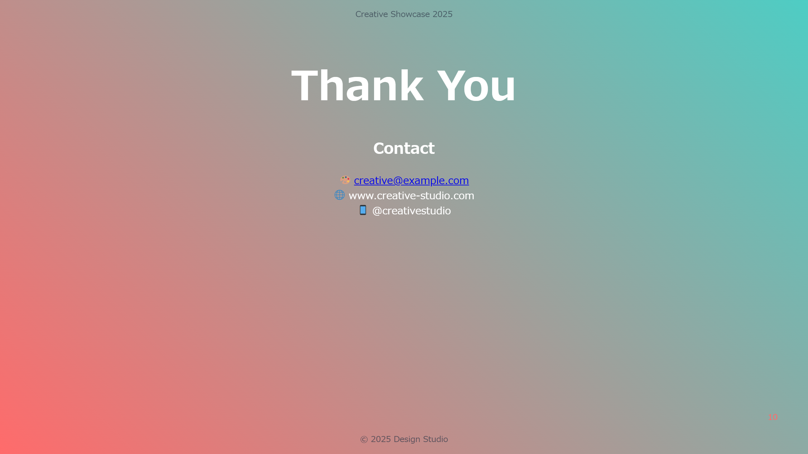

# 🎨 ビビッドクリエイティブテーマ

このサンプルは、クリエイティブなプレゼンテーションのための鮮やかなデザインテーマです。

## 📷 スライドプレビュー












## 🎨 デザインの特徴

- 鮮やかなグラデーションの活用
- アニメーションエフェクト
- モダンなレイアウト
- インタラクティブな要素

## 💫 スタイルのハイライト

```css
/* グラデーション設定 */
:root {
    --gradient-1: linear-gradient(45deg, #FF6B6B, #4ECDC4);
    --gradient-2: linear-gradient(135deg, #45B7D1, #96CEB4);
    --accent-color: #FF6B6B;
}

/* アニメーション */
@keyframes gradient-shift {
    0% { background-position: 0% 50%; }
    50% { background-position: 100% 50%; }
    100% { background-position: 0% 50%; }
}

/* カラーボックス */
.color-box {
    padding: 2em;
    border-radius: 10px;
    color: white;
    text-align: center;
    width: 150px;
    transition: transform 0.3s ease;
}

.color-box:hover {
    transform: scale(1.05);
}
```

## 🛠️ 使用方法

1. `slides.md`にコンテンツを記述
2. `vivid-creative.css`をテーマとして指定
3. Marp CLIでビルド：
```bash
npx @marp-team/marp-cli slides.md --theme ./vivid-creative.css
```

## 📦 ファイル構成

- `slides.md` - プレゼンテーションのソース
- `vivid-creative.css` - カスタムテーマ定義
- `images/` - 生成された画像ファイル

## ✨ 特別機能

- インタラクティブな要素
- アニメーションエフェクト
- レスポンシブデザイン
- カラーパレットの視覚的表示
- 画像ギャラリーグリッド
