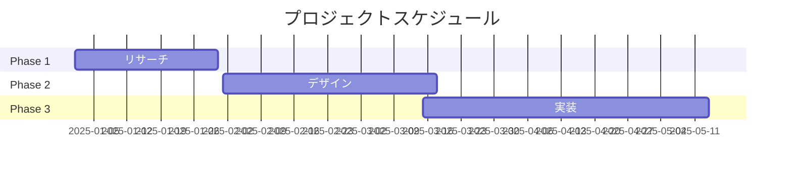

<!-- _class: splash -->
# Creative Design
## 2025 Trend Collection

---

<!-- _class: concept -->
# デザインコンセプト

## 🎨 Color
鮮やかな色彩の組み合わせ

## 🌊 Flow
自然な流れを表現

## 💫 Motion
動きのある要素

## 🔷 Shape
幾何学的なフォルム

---

<!-- _class: showcase -->
# Portfolio Showcase

---

<!-- _class: color-palette -->
# Color Palette 2025

Coral Red

Mint

Ocean Blue

Sage

---

<!-- _class: typography -->
# Typography

# Heading 1
## Heading 2
### Heading 3

**Bold Statement**
*Elegant Italic*
`Monospace Code`

> Inspirational Quote

---

<!-- _class: design-elements -->
# デザイン要素

## Shapes
○ □ △ ◇
geometric & organic

## Textures
🌊 波紋
🔮 ガラス
🌸 自然

## Patterns
⚫️ ドット
🔲 グリッド
〰️ ウェーブ

---

<!-- _class: timeline -->
# Project Timeline

---

<!-- _class: stats -->
# Analytics

    <h3>98%</h3>
    
User Satisfaction

    <h3>+45%</h3>
    
Engagement

    <h3>250k</h3>
    
Monthly Views

---

<!-- _class: gallery -->
# インスピレーション

    
    
    
    

---

<!-- _class: closing -->
# Thank You

## Contact
🎨 creative@example.com
🌐 www.creative-studio.com
📱 @creativestudio
